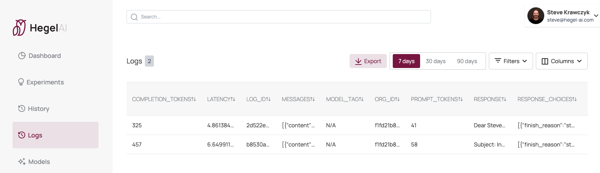

# SDR-Demo

> DISCLAIMER: This app is a minimal demo for [Hegel AI's](https://hegel-ai.com) monitoring and online evaluation platform. You can sign up [here](https://app.hegel-ai.com).

:wave:

Hey there, 

SDR-Demo is a GPT-powered email generator. It uses key-value pairs describing a prospect, and a text input description of the offer, to generate an outbound sales email.

At the bottom of the generated email, users can provide a thumbs up or thumbs down response for the generated email, which will be recorded by Hegel AI's logger.

Logs will be visible at https://app.hegel-ai.com/logs.

## Getting started

You can kick off the frontend by running `npm start` from the `frontend` directory. The app should start running on `http://localhost:3000`.

### Node.js Backend
To kick off the backend, you must set your `HEGELAI_API_KEY` and `OPENAI_API_KEY`. If you need a Hegel AI API key, you can sign up [here](https://app.hegel-ai.com). Then, you can run `npm i; npx ts-node app.ts` from the `node/` subdirectory to start the backend on `http://127.0.0.1:5000`.

### Python Flask Backend
To kick off the backend, you must set your `HEGELAI_API_KEY` and `OPENAI_API_KEY`. If you need a Hegel AI API key, you can sign up [here](https://app.hegel-ai.com). Then, you can run `export FLASK_APP=app.py; python -m flask run -p 5000` from the `flask/` subdirectory to start the backend on `http://127.0.0.1:5000`.

After starting the frontend and backend, the app should be working end to end. As long as your Hegel AI API key is set, logs will be visible at https://app.hegel-ai.com/logs.

